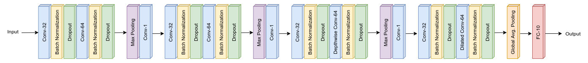
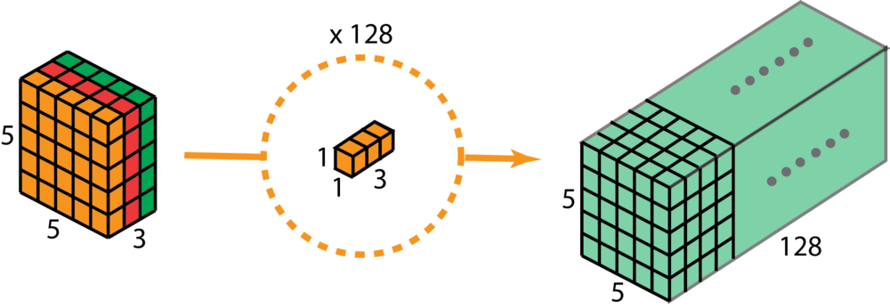
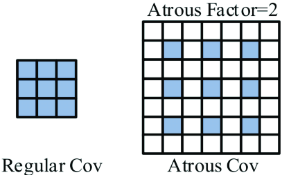
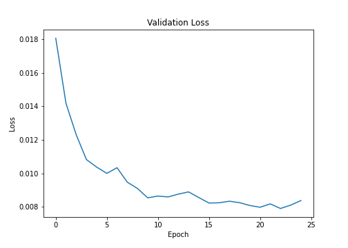
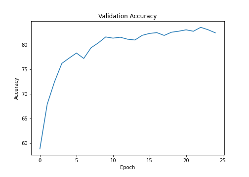
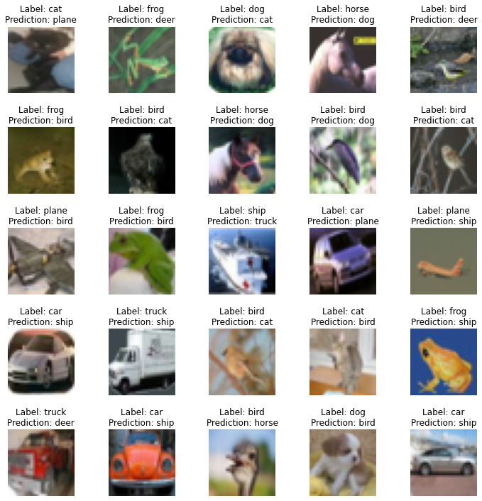

## Types of Convolutions

In this exercise we are going to look into the type of convolutions other than the regular convolution and max pooling. In the exercise we are going to use the **CIFAR10** dataset.

The model uses,

1. Convolution with stride 1
2. Pointwise Convolution
3. Atrous Convolution
4. Depthwise Seperable Convolution
5. Max Pooling

### Model Architecture

### Pointwise Convolution: 
1x1 Convolution is called as pointwise convolution. Reduces the parameters, efficient and can be used to increase or decrease the number of channels at relatively less computational requirement than regular convolution.

### Atrous Convolution: 
Also called as dilated convolution has a dilated kernel insead of the conventional kernel. With the dilated kernel one can achieve the desired receptive field i.e. if a regular 3x3 kernel gives a receptive field jump to 5x5 from 3x3, the dilated kernel of rate 2 will give a jump of 7x7 from 5x5. changing the dilation will help in control over the receptive field. This type of convolution is used in Dense problems such as Super Resolution, Object Detection, Segmentation, Keypoint Detection etc.

### Depthwise Seperable Convolution:
Depthwise seperable convolution is a tactical method which splits a 3x3x32 convolution into (3x3x1)x32 followed by a 1x1 convolution. This helps in reduction of the computational requirements for the model hence uses less resource. Widely used in Mobile phone gpu based models.

### Exercise Results

validation loss

validation accuracy

25 missclassified images by the model

