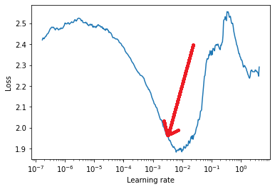

# Learning Rates

The objective of this exercise is to implement a ResNet-18 model trained with learning rates found by LR scheduler. The model reaches a maximum accuracy of **90.67%** on CIFAR-10.

## LR Finder

Learning Rate finder is the effective way to find out the best starting learning rate for the DNN model hence if the learning rate is low the model could take too long to converge on ther other hand if it is too high it can escape the global minima. LR Finder helps to overcome this problem by calculating loss values for a range of arbitrary learning rates.

## Plateaus

During the DNN training process there could be certain regions in the loss functions which is almost flat, in those cases it is good add some momentum to the SGD.

## Change in Training and Validation Accuracy

## GradCAM

Some of the examples of GradCAM on misclassified images is shown below:

