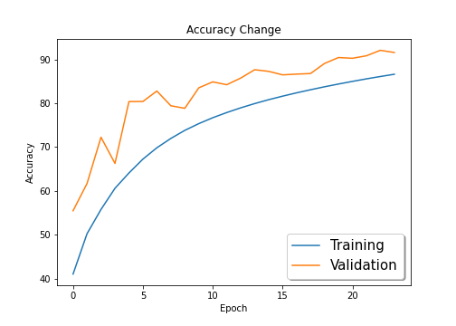

# Super Convergence

In this exercise we are going to train a Residual Network on **CIFAR-10** dataset and achieve a validation accuracy of **91.56%** in just **24** using Superconvergence techniques. 

Selecting a good starting learning rate is merely the first step. In order to efficiently train a robust model, we will need to gradually decrease the learning rate during training. If the learning rate remains unchanged during the course of training, it might be too large to converge and cause the loss function to fluctuate around the local minimum. The approach is to use a higher learning rate to quickly reach the regions of (local) minima during the initial training stage, and set a smaller learning rate as training progresses in order to explore “deeper and more thoroughly” in the region to find the minimum.

## The Learning Rate Policy

This is a scheme under which the learning rate is going to change through the course of training. The essence of the learning rate policy comes from the observation that increasing the LR might have a short term negative effect
and yet achieve a longer-term beneficial effect. This observation leads to the idea of letting the LR vary within a range of values rather than adopting a stepwise fixed or exponentially decreasing value.

### 1. Triangular Schedule

### 2. One Cycle Policy

## Model history

