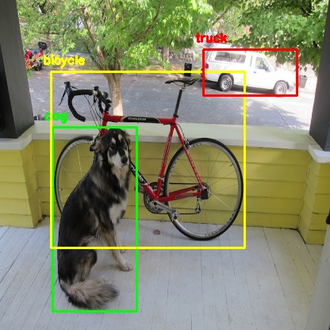

# Object Localization YOLO

1. In this exercise we are going to train a ResNet-18 model on **TinyImageNet** data to a validation accuray of **56.16%**

2. Prepare data annotation and Select Bounding Boxes for a custom dataset collected from Google Images.

## Tiny ImageNet training History

## Object Detection

Object detection is a computer vision technique that allows us to identify and locate objects in an image or video. **YOLO** is one of the SOTA Object detection models currently used for various applications.

In order to train YOLO we need to annotate the exact objects which we want to detect with bounding boxes. The dataset has been annotates using <a href="https://www.robots.ox.ac.uk/~vgg/software/via/via_demo.html">VIA</a>. This will give a  with the dimentions of the bounding boxes.

The json file attributes are explained below,

**images**
    id: Image id
    width: Width of the image
    height: Height of the image
    filename: Filename of the Image
    license: License id for the image
    date_captured: Date of capture of the image
**annotations**
    id: Annotation id
    image_id: Id of the image the annotation is associated with
    category_id: Id of the class the annotation belongs to
    segmentation: (x, y) coordinates of the four corners of the bounding box
    area: Area of the bounding box
    bbox: (x, y) coordinate of the top-left corner and width and height of the bounding box
    iscrowd: If the image has a crowd of objects denoted by this annotation

## Bounding Box Selection

Bounding Box selection is done by K-means clustering where k is the number of bounding boxes.

Based on above graph we can select k = 7 and k = 8 hence after these values the rate of change is very less.

### k = 7 plots

### k = 8 plots

