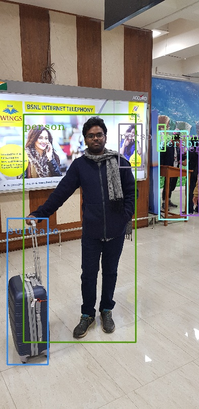
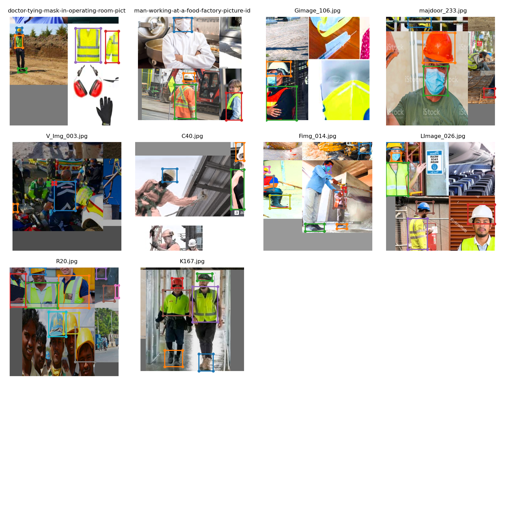
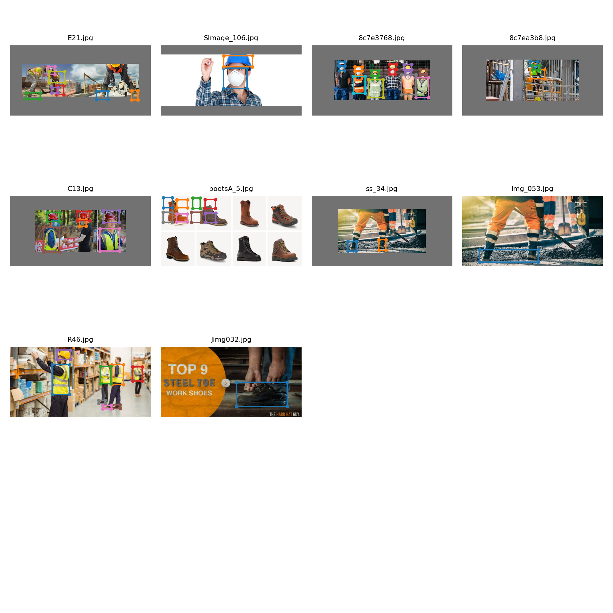
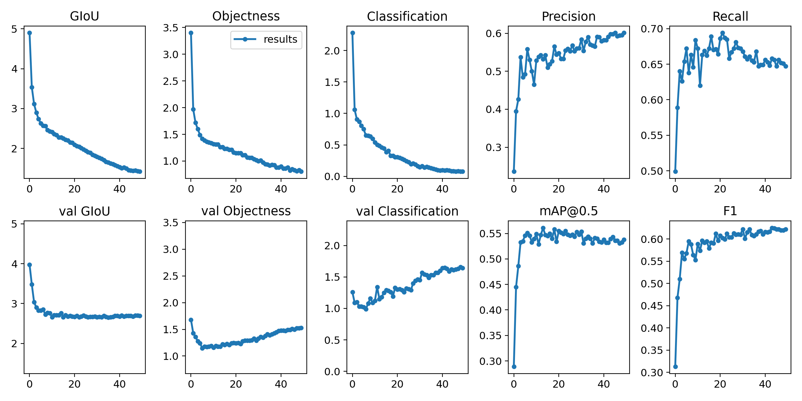

# Object Detection using YOLO v3 and Training with Cutom Dataset

In this exercise we are going to dive into Object Detection

1. Use the YOLO v3 weights trained from COCO dataset and Inference with a Test image.
2. Collect, Annotate and Train YOLO v3 with the Custom Dataset.

## 1. Inferencing using YOLO v3 weights

Follow the steps mentioned [here](https://pysource.com/2019/06/27/yolo-object-detection-using-opencv-with-python/). Inferece result for the COCO classes present in the custom image.

## 2. Train YOLO v3 using custom dataset.

The custom dataset is collected from google images for the below mentioned classes,

Construction Safety Gears data,

1. hardhat
2. mask
3. vest
4. boots

Use the annotation tool from https://github.com/miki998/YoloV3_Annotation_Tool to annotate the custom dataset with Bounding Boxes

### Initializing model with Pre-Trained weights

Download  `yolov3-spp-ultralytics.pt` from this [link](https://drive.google.com/open?id=1LezFG5g3BCW6iYaV89B2i64cqEUZD7e0) and place it in [this](YoloV3/weights) directory.

Follow the folder structure under `data/customdata` folder

### Train the model

Parameters used,

1. batch 16
2. epochs 300
3. images 3500
4. Change the cfg/yolov3_custom.cfg parameters as
    -- filters=(4[BBx dim]+1[objectness]+4[# of BBx]) * 3[# of Anchor Boxes] in all convolution sections above [yolo]
    -- classes=4[# of classes] in all [yolo] sections

`$ python3.6 train.py --data data/customdata/custom.data --batch 16 --cache --cfg cfg/yolov3-custom.cfg --epochs 300`

### Check the training data used to train with "Ricap" augmentation

### Extract frames from a sample video file

Place the video in YoloV3 folder and run,

`$ ffmpeg -i sample.mp4 source/img%3d.jpg` to extract frames from video into source folder

### Detect Bounding boxes with the trained weights

`$ python3.6 detect.py --source source --conf-thres 0.1 --output output`

### Check the detected bounding boxes for the frames

### Combine the output frames back into video file

`$ ffmpeg -framerate 24 -i output/img%3d.jpg -r 24 -y detected.mp4`

### See the video ran via YOLO v3 for Contruction Safety Gear data

Click the video to play

### Metrics

