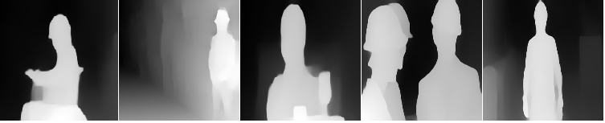
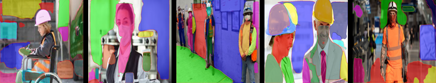

# Dataset Preparation for S15 and MaskRCNN

## Part-I: Optional Assignment

Experiment with maskRCNN and feed a video to [Detectron](https://colab.research.google.com/drive/16jcaJoc6bCFAQ96jDe2HwtXj7BMD_-m5?usp=sharing) and upload results.

**Click the video to play**

[](https://www.youtube.com/watch?v=JhJbKoJb_fs 'What Autopilot sees?')

## Part II: Data preparation for Capstone Project

Please refer to the ` dataset` folder to have a look at the dataset sample images. The dataset constitutes of 3 different input types which are,

1. Normal Images with Bounding Boxes for classes (hardhat, vest, mask, boots)
2. Depth images inferenced from Normal Images using [MiDAS](https://github.com/intel-isl/MiDaS)
3. Planer images inferenced from Normal Images using [PlanerCNN](https://github.com/NVlabs/planercnn)

The complete dataset can be accessed here https://drive.google.com/drive/folders/14zw_X1ImyOo71jEGyxT7ARxVV8t1rYDU

### Folder Structure

```bash
/dataset
    |--/images (Raw images)
        |-- img1.jpg  
        |-- img2.jpg  
        |-- img3.jpg  
        |-- ...  
    |--/labels (Bounding box dimensions)  
        |-- img1.txt  
        |-- img2.txt  
        |-- img3.txt  
        |-- ...  
    |--/depth_images (from MiDAS)  
        |-- depth_img1.png  
        |-- depth_img2.png  
        |-- depth_img3.png  
        |-- ...  
    |--/planer_images  
        |-- planer_img1.png  
        |-- planer_img1.png  
        |-- planer_img1.png  
        |-- ...  
    |-- custom.data (explaining no. of classes and train/test file reference)  
    |-- custom.names (class names)  
    |-- train.shapes (Pixel Resolution of train images)  
    |-- test.shapes (Pixel Resolution of test images)  
    |-- train.txt (Train image paths)  
    |-- test.txt (Test image paths)
```

### Display Sample Images

#### 1. Original Images


#### 2. Depth Images

Dark region is farthest and bright region is nearest.



#### 3. Planer Images



## Submitted By

* Saravana Alagar: sarvan0506@gmail.com
* Ravi Das Vaishnav: ravivaishnav20@gmail.com
