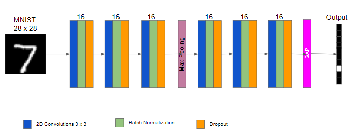
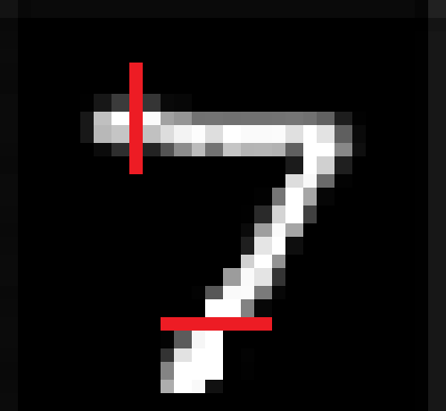

## Neural_Network_Optimization

The objective of this exercise is to take a CNN and optimize it to attain an accuracy of **99.4%** on *MNIST dataset* with less than *20K* model parameters in less than *20 epochs*.

### Architecture

### Bad Network

We have a bad network where lot of things are not correct and it is not performing good. The accuracy of this model is **38.95%** Below mentioned are the changes that will not only improve the accuracy of the model but also reduce the number of parametes used

#### 1. Remove ReLU before prediction Layer.

Before ReLU we see that the network uses ReLU. We should not use any other step such as ReLU, Batch Normalization, Dropout etc. Because we are essentially tampering the prediction done by the network by adding such layers. So we should remove ReLU

#### 2. Changing Model Architecture

The 1st model architecture has 3 blocks having 2,2,3 convolutions respectively. Which is not bad, but in order to achieve 99.4% as validation accuracy we need a better architecture than this. In the MNIST dataset we can identify Edges and Gradients significantly at a Receptive Field of 7.

Hence we will add 3 Convolutions to the 1st block; followed by max-pooling.

#### 3. Adding Batch Normalization

Added Batch Normalization after every convolution layer to Normalize the channel values with mean and standard deviation of the executed batch, this helps the channels to retain useful information without exploding or vanishing the channel values due to back to back matrix multiplication in the form of Convolutions

#### 4. Adding Dropout

Added Dropout to the model which randomly makes a porion of channel values to 0 and helps the Network to not model noise or overfitting. This is also called as Regularization.

#### 5. Global Average Pooling

Finally adding GAP(Global Average Pooling) to reduce the final convolution to one-hot vectors by averaging the channel values.

After all the changes made the network is able to reach **99.47%** of validation accuracy with just **13402** parameters in less than **20** epochs!!
 