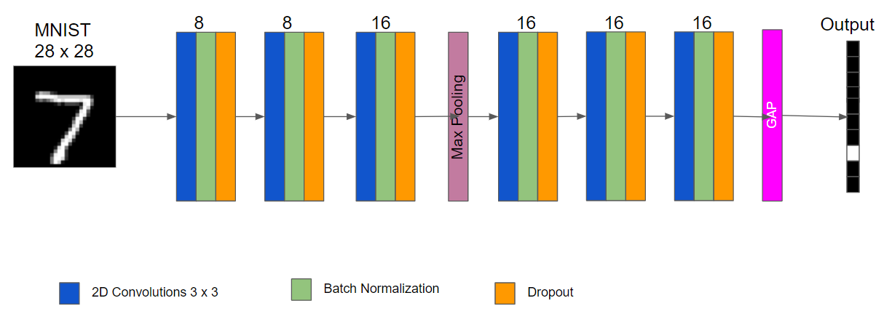
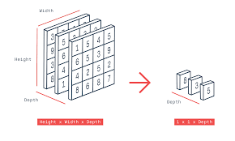
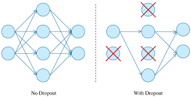
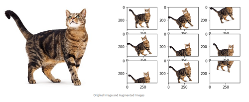
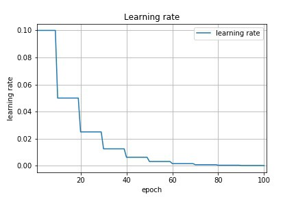

## Neural_Network_Optimization

The objective of this exercise is to take a CNN and optimize it to attain an accuracy of **99.4%** on *MNIST dataset* with less than *10K* model parameters in *15 epochs*.

The target is achieved in a step by step manner by tuning and observing the model's performance.

## Step 1

#### Target

1. Settle on an Architecture
2. Visualize Data
3. Define Data Loaders
4. Define data transformations, Image Normalization
5. Designing a capable model architecture

#### Result

1. Parameters: **147,658**
2. Best Training Accuracy: **99.81**
3. Best Test Accuracy: **99.14**

#### Analysis

1. Model trains very good
2. Capable model as both train and test accuracies above 99
3. There is Over-fitting

### Architecture

## Step 2

#### Target

1. Reduce model parameters by decreasing # of channel
2. Apply GAP(Global Average Pooling) to increase accuracy
3. Add Batch Normalization to increase accuracy

#### Result

1. Parameters: **8,952**
2. Best Training Accuracy: **99.35**
3. Best Test Accuracy: **99.38**

#### Analysis

1. Model performs very good and very close to the target
2. Model performance is not consistent 
3. There is a bit of fluctuation in the test accuracy

#### Batch Normalization

Added Batch Normalization after every convolution layer to Normalize the channel values with mean and standard deviation of the executed batch, this helps the channels to retain useful information without exploding or vanishing the channel values due to back to back matrix multiplication in the form of Convolutions

#### Global Average Pooling (GAP)

Adding GAP(Global Average Pooling) to reduce the final convolution to one-hot vectors by averaging the channel values.

## Step 3

#### Target

1. Apply Dropout and Image Augmentation to reduce fluctuation

#### Result

1. Parameters: **8,952**
2. Best Training Accuracy: **99.14**
3. Best Test Accuracy: **99.41**

#### Analysis

1. Model performs very good and hit the target once but not steadily meeting the target
2. Test accuracy reduces after hitting the target.
3. If the learning rate is adjusted the model could hit the target consistently

#### Dropout

Added Dropout to the model which randomly makes a porion of channel values to 0 and helps the Network to not model noise or overfitting. This is also called as Regularization.

#### Image Augmentation

Image augmentation artificially creates training images through different ways of processing or combination of multiple processing, such as random rotation, shifts, shear and flips, etc. at a Random order there by creating an illusion of a larger dataset. This help to reduce overfitting problem.

## Step 4

#### Target

1. Apply Learning Rate Scheduler

#### Result

1. Parameters: **8,952**
2. Best Training Accuracy: **99.22**
3. Best Test Accuracy: **99.47**

#### Analysis

1. Model reached the target consistently in the last few epochs
2. LR Scheduler helped the model to converge better and be consistent

#### Learning Rate Scheduler

Learning rate scheduler seek to adjust the learning rate during training by reducing the learning rate according to a pre-defined policy. This offers supreme control over the training process and helps the model to converge quicker.

After all the changes made the network is able to reach **99.47%** of validation accuracy with just **8952** parameters in **15** epochs!!
