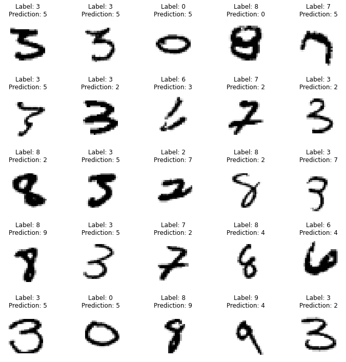

## Regularization in Neural_Networks

The objective of this exercise is to implement various regularization techniques available and compare the results. The dataset used is MNIST hand written digits. Below mentioned are the experiments done;

1. L1 + BN
2. L2 + BN
3. L1 + L2 + BN
4. GBN
5. L1 + L2 + GBN

### L1 Regularization

L1 or Lasso (Least Absolute Shrinkage and Selection Operator) Regularization is based on the L1 norm (Manhattan Distance) adds “absolute value of magnitude” of coefficient as penalty term to the loss function. Due to the Modulo operator the L1 tends to push the insignificant weights towards 0 which fortunately is what regularization means in Machine Learning world. 

### L2 Regularization

L2 or Ridge Regularization is based on the L2 norm (Euclidean distance) which adds “squared magnitude” of coefficient as penalty term to the loss function. Unlike L1 the L2 regularization doesn't push weights to zero; rather allow very low value to be present. This doesn't care about the absolute magnitude on the other hand nudge almost all the weights towards minima.

#### Cost functions

### Ghost Batch Normalization

GBN is a technique which allows the batch normalization to work even in small batches irrespective of the risk of sampling homogenous class in a minibatch. It achieves this by tracking a rolling window statistics of mean and standard deviations and learn Beta and Gamma  as in the traditional Batch Normalization across minibatches. This helps the algorithm to not only take advantage of BN but also learns the stochastic behaviour of the covariance shift of the input features. Another huge advantage of this technique is the ability to train on multiple GPUs simultaneously.

### Model Architecture

### Experiment Results

## Loss

 

## accuracy

 

## Missclassified images by L1 + L2 + GBN

