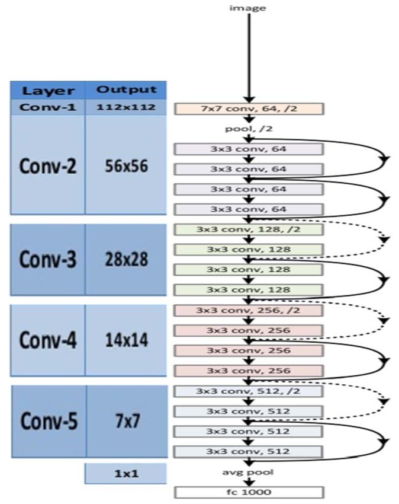
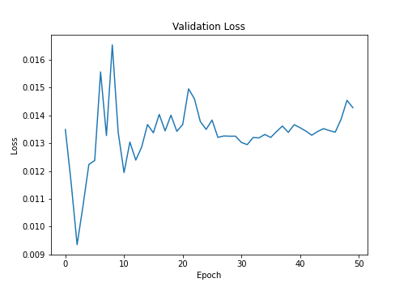
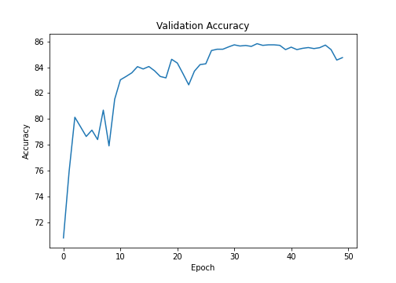

# Receptive Fields and Network Architecture - Resnet18

In this exercise we are going to run a Resnet18 model on Cifar10 dataset

The model reaches a maximum accuracy of **85.74%** in **37 epochs** .

## Resnet18 Architecture

## Residual block

## Validation Loss

## Validation Accuracy

## Missclassified Images

