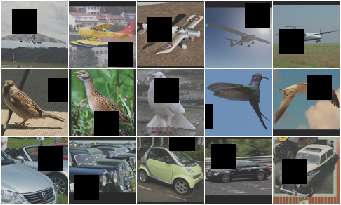
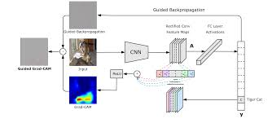
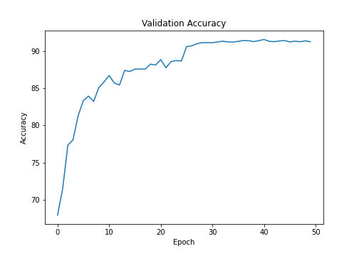

# Cutout and GradCAM

The objective of this exercise is to implement a Data Augmentation technique called Cutout and implement GradCAM to visulaize the attention of the ResNet-18 model. The model reaches a maximum accuracy of **91.45%** on CIFAR-10.

## Cutout

Cutout is a data augmentation technique which randomly makes a rectangular patch of the training images to a value of zero/mean. The size of the patch is randomly chosen, this helps to overcome Overfitting problem by creating a illusion of more training samples.

## GradCAM

GradCAM(Gradient-weighted Class Activation Mapping) uses the gradients of a target images, flowing back from the prediction layer to convolutional layers to produce a coarse localization map highlighting the important regions in the image for predicting the image.

## Change in Training and Validation Accuracy

## GradCAM for some targets

Some of the examples of GradCAM on misclassified images is shown below:

